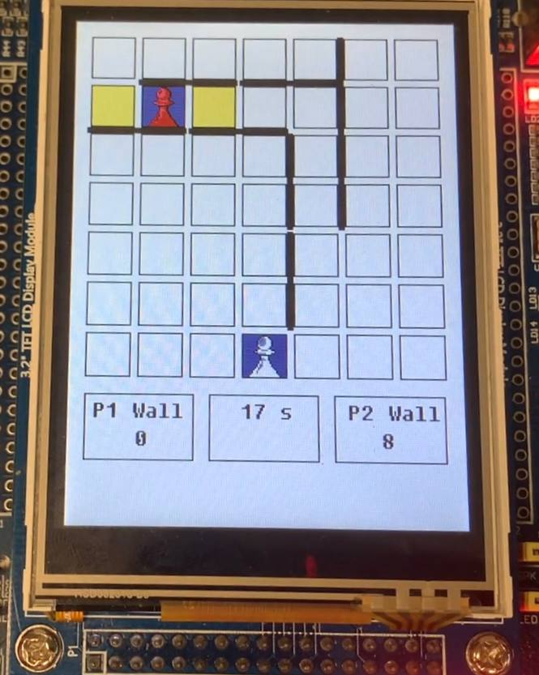

# Quoridor Game Implementation on LPC1768

This repository contains the implementation of the Quoridor board game on the LPC1768 microcontroller, developed as part of an academic project by Emanuele Coricciati.

<p align="center">
  
</p>
 
## Game Overview

**Quoridor** is a strategic board game where the goal is to move your pawn to the opposite side of the board while simultaneously blocking your opponent's progress by placing barriers.

## Implementation Details

The game has been implemented using various libraries to handle the peripherals of the LPC1768 board. Below are the main features and functionalities.

### Game Board

- The game board is represented as a 15x15 matrix.
- **Player 1** and **Player 2** are represented by the values `1` and `2`, respectively.
- `0` represents an empty cell.
- Multiples of `3` represent walls.
- Even rows and columns represent walls, while odd rows and columns represent player positions.

### Players and Walls

Players are represented by a data structure that tracks:
- Remaining walls.
- Possible moves.
- Current position.

Walls are also represented using a structure that stores their position and orientation.

### Game Modes

The game supports the following modes:
- Single Board / Double Board.
- Single Player / NPC (AI).

The game mode can be selected from a menu implemented using a dedicated data structure.

## Timers

Two timers are used in the game:

- **TIMER0**: Defines the time available for each player. It is set to 1 second, and the handler updates a variable to represent the passage of time. When 20 seconds pass, the turn is automatically passed to the opponent.
  
- **TIMER1**: Displays messages on the screen for 5 seconds in case of invalid moves (e.g., blocking a player using BFS or placing walls in invalid positions).

## LCD Display

In the `GLCD.c` file, various functions are provided to render objects on the screen. Pawns are drawn using a color mapping system, implemented with the matrix found in the `game_assets.h` file.

## CAN Communication

The multiplayer mode (double board) is implemented using the **CAN1** protocol.

- Once the multiplayer mode is selected, and the opponent (NPC or human) is chosen, the system allows selection of which board will be player 1 for synchronization.
- Synchronization happens through a handshake signal between player 1 and player 2, with an acknowledgment (ACK) signal.
- Moves are communicated using encoded/decoded packets that contain all necessary information.

## NPC (AI)

The AI is implemented using a **Minimax algorithm with alpha-beta pruning**.

- The Minimax algorithm aims to maximize the maximizing player's advantage while minimizing the minimizing player's advantage by considering all possible moves up to a certain depth.
- The evaluation of moves is based on:
  - The distance of the players from the goal (calculated using a BFS for the shortest path).
  - The number of remaining walls.
- Movement moves are ordered based on proximity to the goal, while walls are placed by calculating the Manhattan distance between the wall and the opponent.
- The total number of moves for each player is set to 21, and the tree depth is set to 2 to avoid stack issues during recursion. These values can be modified in the `game.h` and `agent.h` files.

## RIT (Repetitive Interrupt Timer)

The RIT is set to 50 ms to handle the control of the joystick (left, up, right, down, select) and buttons (INT0, KEY1, and KEY2).

## How to Build and Run

Warning: The code is quite large, and the free license may not be sufficient to run it. You will need to obtain a license. In my case, the university provides a license for students; I just had to follow the instructions given by the professor.

1. Clone the repository:
   ```
   git clone <repository-url>
   ```
2. Open the `sample.uvprojx` file with [Keil](https://www.keil.com/). The raccomanded version is Keil 5   
3. Compile and load the project to the LPC1768 board.
4. Use the connected display and controls to play the game.

## Images

| **Start**                | **Try to trap a player**                |
|----------------------------|----------------------------|
|  |  |
| **Walls**                | **Win modal**                |
|  |  |


